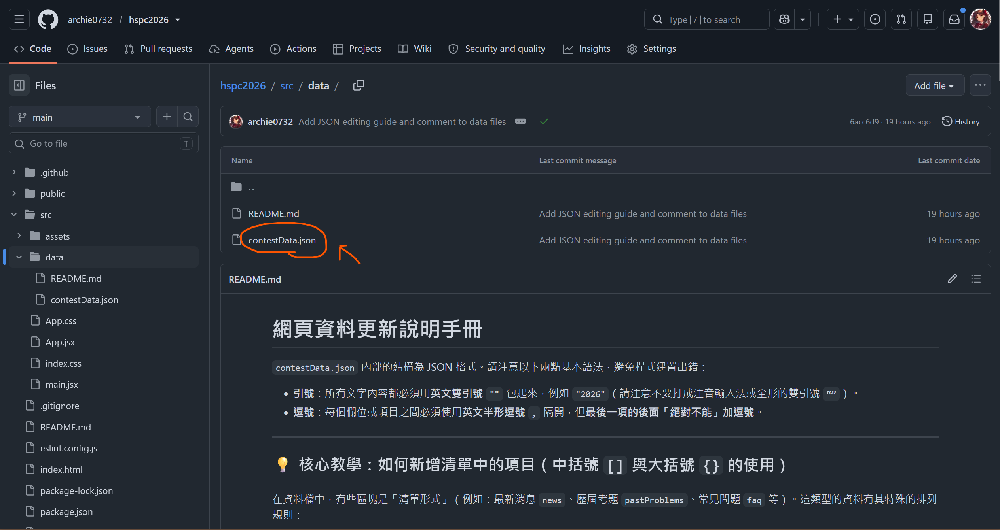
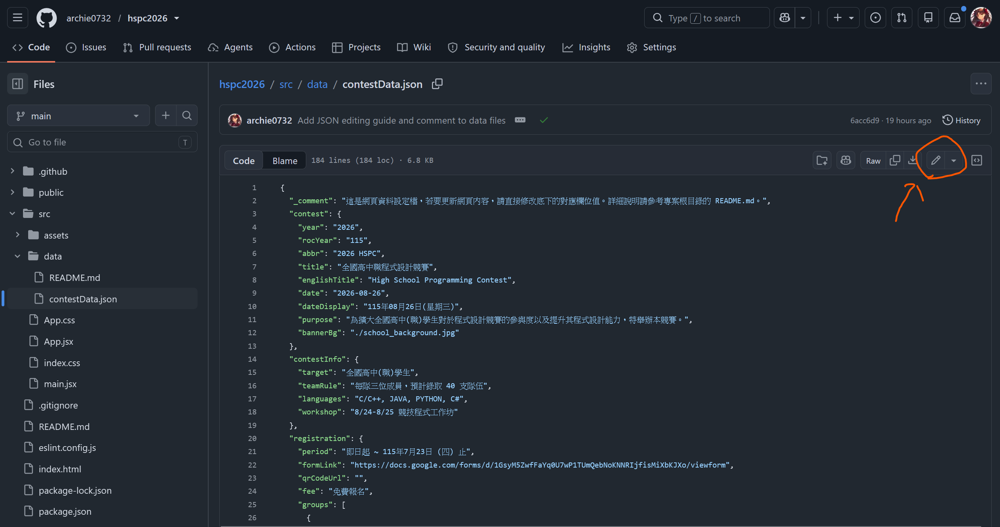

# 2026 HSPC 全國高中職程式設計競賽網頁 —— 內容更新與維護手冊

本網頁使用 **React** + **Vite** 開發。為了讓主辦單位（非技術背景人員）能夠輕鬆、快速地更新網頁內容，所有文字、日期、報名連結、競賽規則及歷屆考題，都集中在一個簡單的資料檔案中。

您不需要寫任何網頁程式碼，只需要編輯一個資料檔案，網頁就會自動更新！

---

## 🚀 快速線上更新步驟（免安裝任何軟體）

主辦單位的人員可以直接在 **GitHub 網站**上修改內容，送出後系統會自動在後台建置，大約 **1-2 分鐘內**網頁就會自動更新完成：

1. **登入 GitHub** 並前往您的專案頁面。
2. 點擊進入資料夾路徑：`src` ➡️ `data` ➡️ 點擊 **`contestData.json`** 檔案。

   

3. 點擊右上角的 **✏️（編輯此檔案，Edit this file）** 按鈕。

   

4. 修改您要調整的欄位文字（請參考下方[最新消息更新教學](#-實戰教學如何更新最新消息news)與[欄位對照表](#-contestdatajson-欄位對照表)）。
5. 修改完畢後，點選右上角綠色的 **Commit changes...（提交變更）**。
6. 在彈出視窗中直接點擊 **Commit changes** 送出。
7. 系統會自動部署，稍等 1-2 分鐘後重新整理網頁即可看到新內容！

> [!IMPORTANT]
> **⚠️ 兩大 JSON 語法防錯規則：**
> 1. **雙引號**：所有文字都必須用**英文半形雙引號 `""`** 包起來（如 `"2026"`）。請勿打成注音或全形的雙引號（如 `“”`）。
> 2. **英文逗號**：每個欄位或項目之間必須使用**英文半形逗號 `,`** 隔開，但**最後一個項目的後面「絕對不能」有逗號**。

---

## 📢 實戰教學：如何更新「最新消息 (news)」

「最新消息」在資料檔中是一個列表清單，每一則消息都被一對花括號 `{ }` 包住，並排列在中括號 `[ ]` 的裡面。

### 📋 最新消息的欄位介紹
每則消息有 5 個欄位，請依照實際狀況填寫：
* `"id"`：消息的編號。請依序遞增（例如原本到 `2`，新的一則就是 `3`）。
* `"date"`：發布日期。格式必須是 `"西元年-月-日"`（例如 `"2026-07-07"`）。
* `"title"`：消息標題。
* `"content"`：消息的詳細內容.
* `"url"`：這則消息的相關連結（例如：簡章下載、Google 報名表單等）。
  * 💡 **小技巧**：如果有填寫網址，網頁上會自動長出一個「開啟連結」按鈕。如果不需要連結按鈕，**請直接保留雙引號留空即可（即 `""`）**。

---

### 1️⃣ 情況一：只是「修改」現有的消息內容
若您只需調整已有的公告字句：
1. 找到對應的消息區塊。
2. 直接修改雙引號 `""` 內部的文字（例如將 `"date"`、`"title"` 或 `"content"` 的內容換掉）。
3. **⚠️ 注意**：不要刪除引號，也不要動到大括號結尾的逗號。

* **範例：將第一則消息的標題修改**
  * 修改前：`"title": "2026 HSPC 網頁正式上線與報名開始"`
  * 修改後：`"title": "【最新公告】8/24 工作坊報名資訊更新"`

---

### 2️⃣ 情況二：想要「新增」一則新消息
當有新消息要發布時，請依照下列步驟操作：

1. **補上逗號**：找到目前**最後一則消息**的大括號結尾 `}`，並在它後面補上一個**半形英文逗號 `,`**。
2. **貼上新項目**：在下方起一個新行，複製並貼上完整的消息花括號區塊。
3. **更改內容**：修改新貼上區塊的內容，並把 `"id"` 的號碼加 1。
4. **⚠️ 確認結尾無逗號**：確認這則最新（即最底下最後一筆）消息的大括號結尾 `}` 後面**沒有**加逗號。

#### 💻 新增前與新增後的程式碼對比：

##### 調整前（只有兩則消息，最後一則結尾無逗號）：
```json
"news": [
  {
    "id": 1,
    "date": "2026-07-06",
    "title": "2026 HSPC 網頁正式上線與報名開始",
    "content": "歡迎全國高中職學生踴躍組隊報名參加！",
    "url": ""
  },
  {
    "id": 2,
    "date": "2026-07-01",
    "title": "【重要日程】報名截止於 7/23 (四)",
    "content": "請注意，線上組隊報名截止時間為 7/23 (四)。",
    "url": ""
  } // 👈 這是最後一則，結尾大括號後面沒有逗號
]
```

##### 調整後（成功新增第三則消息，原本的第二則結尾補了逗號）：
```json
"news": [
  {
    "id": 1,
    "date": "2026-07-06",
    "title": "2026 HSPC 網頁正式上線與報名開始",
    "content": "歡迎全國高中職學生踴躍組隊報名參加！",
    "url": ""
  },
  {
    "id": 2,
    "date": "2026-07-01",
    "title": "【重要日程】報名截止於 7/23 (四)",
    "content": "請注意，線上組隊報名截止時間為 7/23 (四)。",
    "url": ""
  }, // 👈 ⚠️ 步驟 1：因為後面要新增項目，所以這裡必須補上一個半形逗號！
  { // 👈 ⚠️ 步驟 2：新起一行，加上完整的花括號項目
    "id": 3, // 👈 ⚠️ 步驟 3：id 遞增變為 3
    "date": "2026-07-15",
    "title": "【重要公告】延長報名時間至 7/30",
    "content": "經承辦單位決議，線上報名時間延長至 115 年 7 月 30 日 (四) 止。",
    "url": "https://docs.google.com/forms/..."
  } // 👈 ⚠️ 步驟 4：這已經是最後一則消息了，結尾的 } 後面「絕對不能」有逗號！
]
```

---

## 📝 實戰教學：如何更新「報名連結」

網頁中有兩個地方提供報名連結按鈕，為了保持一致，**更新報名網址時請同時修改這兩個欄位**：
1. **上方導覽列的「線上報名」**：點擊導覽選單時會跳轉的表單網址。
2. **首頁中間的「[立即報名]」按鈕**：位於首頁報名方式區塊的大按鈕。

### 📋 欄位位置與修改對照
請在 `contestData.json` 中尋找並修改以下兩個地方：

#### 1️⃣ 第一處：上方導覽列的連結
在 `contestData.json` 靠近上方處找到 `"registration"` 區塊底下的 `"formLink"`，修改其雙引號內部的網址：
```json
"registration": {
  "period": "即日起 ~ 115年7月23日 (四) 止",
  "formLink": "https://您的新 Google 表單網址...", // 👈 修改這裡的網址！
  "qrCodeUrl": "",
  "fee": "免費報名",
...
```

#### 2️⃣ 第二處：首頁中間按鈕的連結
在同一個區塊下，找到 `"groups"` 清單內，`"link"` 欄位，修改其雙引號內部的網址：
```json
  "groups": [
    {
      "name": "高中職新星組",
      "link": "https://您的新 Google 表單網址...", // 👈 修改這裡的網址！
      "status": "開放中"
    }
  ]
```

> [!TIP]
> **💡 貼心提醒**：
> * 這兩個連結通常會填寫**同一個 Google 表單網址**。
> * 修改時請小心**不要刪除網址前後的英文半形雙引號 `""`**，以及欄位結尾的逗號 `,`！

---

## 📖 `contestData.json` 欄位對照表

如果您需要修改其他網頁資訊，請在 `contestData.json` 檔案中尋找對應的欄位進行修改：

| 區塊名稱 | 欄位屬性 | 代表意思 | 範例與填寫建議 |
| :--- | :--- | :--- | :--- |
| **`contest`**<br>(基本資訊) | `"year"` | 西元年份 | `"2026"` |
| | `"rocYear"` | 民國年份 | `"115"` |
| | `"title"` | 競賽中文名稱 | `"全國高中職程式設計競賽"` |
| | `"dateDisplay"` | 顯示的競賽日期 | `"115年08月26日(星期三)"` |
| | `"purpose"` | 競賽目的介紹 | `"為擴大全國高中(職)學生對於程式設計競賽..."` |
| **`contestInfo`**<br>(競賽說明) | `"target"` | 參加對象 | `"全國高中(職)學生"` |
| | `"teamRule"` | 組隊與錄取規則 | `"每隊三位成員，預計錄取 40 支隊伍"` |
| | `"languages"` | 解題語言 | `"C/C++, Java, Python"` |
| **`registration`**<br>(報名資訊) | `"period"` | 報名截止時間 | `"即日起 ~ 115年7月23日 (四) 止"` |
| | `"formLink"` | 報名表單網址 | 點擊「線上報名」按鈕會跳轉的 Google 表單網址 |
| **`contact`**<br>(聯絡資訊) | `"email"` | 聯絡信箱 | 顯示於網頁的 Email，如 `"pu20700@gm.pu.edu.tw"` |
| | `"phone"` | 聯絡電話 | 電話分機，如 `"(04)26328001 轉 18001"` |
| | `"locationName"` | 競賽教室 | `"靜宜大學 資訊處 主顧樓電腦教室"` |
| **`environment`**<br>(上機環境) | `"os"` | 作業系統 | `"Windows 11 / Ubuntu Linux 22.04 LTS"` |
| | `"editors"` | 開發編輯器列表 | 可用 IDE 清單，如 `["Dev-C++ 6.3", "Code::Blocks"]` |
| **`rules`**<br>(詳細規則) | `rules` 列表 | 詳細競賽規則 | 逐條顯示的規則文字，每條規則用雙引號包起並以逗號隔開。 |
| **`faq`**<br>(常見問題) | `faq` 列表 | 常見問題解答 | 包含 `"question"`(問題) 與 `"answer"`(答案) 的物件列表。 |

---

## 🛠️ 技術人員本機開發說明

如果您是網頁工程師，需要修改版面樣式或 React 元件程式碼：

### 1. 安裝相依套件
```bash
npm install
```

### 2. 啟動本機開發伺服器（即時預覽）
```bash
npm run dev
```

### 3. 建置生產環境代碼
```bash
npm run build
```
建置結果會輸出在 `dist` 資料夾中。
